# System & Technical Architecture Document

## Project: SROT (Advanced Multimodal Enterprise RAG)
**Document Version:** 1.1.0  
**Status:** Approved for Agile Execution  

---

## 1. System Topology & Monorepo Layout

SROT is engineered as a clean, high-performance monorepo separating concern between asynchronous AI compute, cloud object storage, vector indexing, transactional cataloging, and an enterprise light Next.js 15 frontend.

```
SROT/
├── apps/
│   ├── api/                      # FastAPI Backend & Celery Worker Service
│   │   ├── core/                 # Config, AES-256 Crypto, S3 multipart client, Celery, Redis SSE
│   │   ├── modules/
│   │   │   ├── tenants/          # Onboarding, Workspace, BYOK Key Vault & Sample Data Seeder
│   │   │   ├── documents/        # S3 multipart presigned dispatch, SSE progress stream, catalog
│   │   │   ├── ingestion/        # Extractors (PDF bounding boxes, XLSX, Audio, Video) & Chunkers
│   │   │   ├── vector/           # Qdrant client, collections, on-disk HNSW & quantization
│   │   │   ├── retrieval/        # Hybrid search, FlashRank reranking, Parent-Child expansion
│   │   │   └── agents/           # Query Router, DuckDB Text-to-SQL agent, Synthesizer
│   │   └── tests/                # Pytest suites for crypto, s3 multipart, extractors, retrieval
│   └── web/                      # Next.js 15 Enterprise Light Web Application
│       ├── src/
│       │   ├── app/              # App router (onboarding, documents, chat, settings)
│       │   ├── components/       # Design System UI components (Chat, Viewers, S3 Multipart Dropzone)
│       │   ├── hooks/            # SWR, useEventSource (SSE progress), streaming hooks
│       │   ├── lib/              # API client, S3 parallel multipart uploader, token helpers
│       │   └── types/            # Strict TypeScript interfaces & Zod schemas
├── infra/                        # Local Dev & Production Infrastructure (Docker Compose)
└── docs/                         # Agile Engineering Specifications (PRD, Architecture, etc.)
```

---

## 2. High-Level Architecture Diagram

```mermaid
flowchart TD
    subgraph Client ["Frontend (Next.js 15 / React 19 / Enterprise Light)"]
        UI_Onboarding["Onboarding Wizard + Sample Data Button"]
        UI_Upload["S3 Multipart Chunked Dropzone (Parallel Parts)"]
        UI_SSE["Real-Time SSE Progress Hook (Redis Pub/Sub)"]
        UI_Chat["Enterprise Analytical Chat & Streaming Answer"]
        UI_Viewers["Split-Pane Viewers: PDF (Bounding Box Overlay) / Video @ Timestamp / Audio / Data Grid"]
    end

    subgraph API_GW ["FastAPI Service Layer"]
        Router_Auth["Auth & Tenant RBAC"]
        Router_Onboarding["Onboarding, Key Vault & Sample Data Controller"]
        Router_Storage["S3 Multipart Presigned URL Dispatcher"]
        Router_SSE["SSE Progress Stream: /api/v1/documents/:id/progress-stream"]
        Router_Ingest["Ingestion Job Dispatcher"]
        Router_Query["Query Router & Synthesis Orchestrator"]
    end

    subgraph Security ["Security & Vault Layer"]
        AES_Engine["AES-256-GCM Envelope Encryption Engine"]
        PG_Vault[("PostgreSQL 16: Encrypted Credentials")]
    end

    subgraph Storage ["Cloud & In-Process Storage Layer"]
        AWS_S3[("AWS S3: s3://bucket/{tenant_id}/{workspace_id}/...")]
        PG_Catalog[("PostgreSQL 16: Tenants, Documents, Chunks, Audit")]
        DuckDB_Engine[("DuckDB: In-Process Tabular Engine")]
    end

    subgraph Workers ["Distributed Worker Pool (Celery 5.6 + Redis 8.1)"]
        Queue_Docs["celery-docs: Docling / PyMuPDF (Bounding Boxes)"]
        Queue_Excel["celery-excel: OpenPyXL / DuckDB Table Registrar"]
        Queue_Media["celery-media: ffmpeg / Faster-Whisper / PySceneDetect"]
        Queue_Vision["celery-vision: OCR / Vision LLM Captioner"]
        Redis_PubSub[("Redis 8.1: Celery Broker & Live Event Pub/Sub")]
    end

    subgraph VectorEngine ["Vector Database (Qdrant v1.19.1)"]
        Qdrant_Store[("Qdrant: Dense + Sparse BM25 (On-Disk HNSW & Scalar Quantization)")]
    end

    subgraph Providers ["Dynamic Model Provider Layer"]
        Cloud_API["Cloud Providers: OpenAI, Gemini, Anthropic, Groq"]
        Local_Host["Local / Private: Ollama, vLLM, OpenAI-Compatible"]
    end

    UI_Onboarding --> Router_Onboarding
    Router_Onboarding --> AES_Engine --> PG_Vault
    UI_Upload --> Router_Storage --> AWS_S3
    UI_Upload -->|Direct Parallel Parts| AWS_S3
    UI_Upload --> Router_Ingest --> Queue_Docs & Queue_Excel & Queue_Media & Queue_Vision
    Queue_Docs & Queue_Excel & Queue_Media & Queue_Vision --> Redis_PubSub --> Router_SSE --> UI_SSE
    Queue_Docs & Queue_Excel & Queue_Media & Queue_Vision --> AWS_S3
    Queue_Docs & Queue_Excel & Queue_Media & Queue_Vision --> Qdrant_Store & PG_Catalog & DuckDB_Engine

    UI_Chat --> Router_Query
    Router_Query --> PG_Vault --> Providers
    Router_Query --> Qdrant_Store
    Router_Query --> DuckDB_Engine
    Router_Query --> UI_Chat
    UI_Chat --> UI_Viewers
```



---

## 3. Modality-Specific Ingestion & Visual Grounding

### 3.1 PDF & Scanned Documents with Visual Bounding Boxes
- **Extractors:** `docling` (v2.123.1) combined with `pymupdf` (v1.28.2).
- **Processing & Bounding Box Grounding:**
  1. Detect digital text vs. scanned image pages (OCR fallback via Docling layout models).
  2. Reconstruct reading order across multi-column scientific or corporate papers.
  3. Detect and extract embedded tables into structured Markdown (`| col1 | col2 |`).
  4. Render high-resolution page preview images and upload to S3:
     `s3://bucket/{tenant_id}/{workspace_id}/{doc_id}/pages/page_{num}.png`.
  5. **Normalized Bounding Box Extraction:**
     - For every heading, paragraph, and table, calculate normalized coordinates:
       `bounding_box: [ymin, xmin, ymax, xmax]` where values range from `0.0` to `1.0`.
     - Stored in both PostgreSQL `document_chunks` and Qdrant vector payload.
     - When the user clicks `[PDF: P.14]` in the chat, the Next.js PDF canvas draws a subtle, translucent highlight box over the exact passage, providing visual auditability.
- **Chunking:** **Hierarchical Parent-Child Chunking**:
  - *Child Chunk (150–250 tokens)*: Single paragraph or table cell group embedded in Qdrant for granular search.
  - *Parent Chunk (800–1200 tokens)*: Encompassing section with headers (`H1 > H2`) passed to the LLM during synthesis to prevent loss of context.

### 3.2 Excel & Tabular Data (Deterministic Accuracy Architecture)
- **Engines:** `openpyxl` (v3.1.5) and `duckdb` (v1.5.5).
- **Dual Representation Strategy:**
  1. **Schema & Semantic Indexing:**
     - Extract sheet names, column headers, inferred types, value distributions, and sample rows.
     - Generate an LLM-assisted table summary and embed in Qdrant under `modality: "tabular_schema"`.
  2. **Deterministic Analytical Engine (DuckDB):**
     - Normalize and convert sheets into optimized Parquet files saved to S3.
     - Register as views/tables in DuckDB.
     - When an analytical/quantitative query arrives ("What is the total expenditure in Q2?"), the Query Router passes the table schema to the **Text-to-SQL Agent**, which executes a read-only DuckDB SQL query, guaranteeing 100% calculation accuracy.

### 3.3 Audio Processing
- **Engine:** `faster-whisper` (v1.2.1) powered by CTranslate2 (GPU/CPU dynamic auto-detection).
- **Processing:**
  1. Downsample audio to 16kHz mono.
  2. Transcribe using Voice Activity Detection (VAD) filter with word- and segment-level timestamps.
  3. Generate 30–45s sliding window chunks with 10s overlap.
  4. Metadata: `{"start_time": 45.2, "end_time": 78.1, "speaker_id": "SPEAKER_01"}`.

### 3.4 Video Processing (Multimodal Temporal Fusion)
- **Engines:** `ffmpeg` + `scenedetect` (v0.7.1) + `faster-whisper` (v1.2.1) + Vision LLM.
- **Dual-Stream Extraction:**
  1. **Audio Track Extraction:** Demux audio track to AAC/WAV $\rightarrow$ Run Whisper transcription with timestamps.
  2. **Visual Track Extraction:**
     - Run `scenedetect` ContentDetector to capture natural scene transitions.
     - Adaptive keyframe capture: sample 1 frame every 4 seconds or on scene boundaries.
     - Save keyframe JPGs to S3 prefix: `s3://bucket/{tenant_id}/{workspace_id}/{doc_id}/keyframes/{frame_id}.jpg`.
     - Run Vision LLM (or local OCR/CLIP) on keyframes to extract slide text, UI diagrams, and visual summary.
  3. **Temporal Fusion:**
     - Fuse visual captions and spoken transcript into unified multimodal temporal chunks:
       `[start_t, end_t] => { transcript: "...", visual_summary: "...", keyframe_s3_url: "..." }`.
     - In the UI, citations render with a video badge `[VID: 04:12]` that deep-links directly into the HTML5 video player.

---

## 4. Scalability Architecture for Massive Data & S3 Upload Resilience

### 4.1 S3 Multipart Presigned Upload Architecture (Files > 50MB)
To eliminate connection timeouts, VPN drops, and gateway proxy limits when uploading multi-gigabyte files (videos, document dumps):
1. **Initiate:** Client calls `POST /api/v1/documents/multipart/initiate` $\rightarrow$ Backend requests S3 `CreateMultipartUpload` and returns `upload_id` and document record.
2. **Presign Parts:** Client requests presigned URLs for 10MB chunk parts via `POST /api/v1/documents/multipart/presign-parts`.
3. **Parallel Client Upload:** Next.js client streams up to 4 parts concurrently using browser `fetch` / `XMLHttpRequest` with progress tracking. Failed parts are retried automatically without restarting the upload.
4. **Complete:** Client calls `POST /api/v1/documents/multipart/complete` passing part numbers and ETags $\rightarrow$ Backend executes S3 `CompleteMultipartUpload` and enqueues Celery processing job.

### 4.2 Real-Time SSE Ingestion Progress Stream (Redis Pub/Sub)
Instead of repetitive polling against PostgreSQL:
1. Ingestion workers publish progress payloads to Redis channel `ingestion:progress:{document_id}`:
   ```json
   {
     "document_id": "uuid",
     "stage": "WHISPER_TRANSCRIBING",
     "percent": 45,
     "message": "Transcribing audio segment 4/12",
     "timestamp": 1727453000
   }
   ```
2. FastAPI provides a persistent SSE stream endpoint:
   `GET /api/v1/documents/:id/progress-stream`
3. Frontend listens via standard `EventSource`, updating the progress bar smoothly with zero database query overhead.

### 4.3 Qdrant Vector Engine Configuration (v1.19.1)
- **On-Disk HNSW Indexes:**
  - `on_disk: true` for both vectors and HNSW indexes:
    ```json
    {
      "vectors": {
        "dense": { "size": 1536, "distance": "Cosine", "on_disk": true }
      },
      "hnsw_config": { "on_disk": true }
    }
    ```
- **Scalar Quantization (`int8`):**
  - Reduces memory footprint by **4x to 8x** with < 1% loss in retrieval recall.
  - Query oversampling factor of `2.0` automatically recovers any quantization precision during reranking.
- **Tenant & Workspace Partitioning:**
  - Payloads store indexed keyword fields: `tenant_id` and `workspace_id`.
  - Qdrant queries use strict filter predicates: `Filter(must=[FieldCondition(key="tenant_id", match=MatchValue(value=tenant_id))])`.

---

## 5. One-Click Enterprise Sample Dataset Seeding Flow

To ensure new workspace administrators can test SROT within 10 seconds of onboarding:
1. SROT bundles an enterprise sample pack in `apps/api/sample_data/`:
   - `sample_financials.xlsx`: Quarterly P&L sheet with multiple tabs and expense breakdowns.
   - `sample_contract.pdf`: Multi-column document with structured tables, clauses, and diagrams.
   - `sample_tech_demo.mp4`: 30-second high-density video with speech and technical slides.
   - `sample_audio_brief.mp3`: 30-second spoken project overview.
2. Clicking **"Load Enterprise Sample Dataset"** triggers `POST /api/v1/onboarding/seed-sample-data`:
   - Asynchronously copies sample assets into the tenant's isolated S3 bucket prefix.
   - Dispatches extraction and indexing pipelines.
   - Redirects user immediately to the Analytical Chat with suggested starter questions.

---

## 6. Exact Pinned Technology Stack

| Component | Library / Tool | Exact Version | Rationale |
| :--- | :--- | :--- | :--- |
| **API Framework** | `fastapi` | $\ge 0.115.0$ | High-concurrency async ASGI gateway |
| **Data Validation** | `pydantic` | $\ge 2.10.0$ | Strict schema parsing and serialization |
| **ORM & Database** | `sqlalchemy` | $\ge 2.0.36$ | Async connection pooling with PostgreSQL 16 |
| **Object Storage** | `boto3` / `aioboto3` | `1.43.100` / `15.5.0` | Async AWS S3 client for presigned multipart uploads |
| **Security & Secrets** | `cryptography` | `50.0.1` | AES-256-GCM envelope encryption for BYOK vault |
| **Token Auth** | `pyjwt` | `2.15.0` | Multi-tenant JWT authorization |
| **Vector Engine** | `qdrant-client` | `1.19.1` | On-disk HNSW, hybrid search, scalar quantization |
| **PDF Extraction** | `docling` / `pymupdf` | `2.123.1` / `1.28.2` | Layout analysis, bounding box extraction & table OCR |
| **Word Extraction** | `python-docx` | `1.2.0` | Header & hierarchical paragraph parsing |
| **Excel Extraction** | `openpyxl` / `duckdb` | `3.1.5` / `1.5.5` | In-process fast SQL execution on tabular data |
| **Speech-to-Text** | `faster-whisper` | `1.2.1` | Word-level timestamped transcription |
| **Video Scene Detect**| `scenedetect` | `0.7.1` | Automated shot transition & keyframe capture |
| **Reranker** | `flashrank` | `0.2.10` | Ultra-fast local ONNX cross-encoder reranking |
| **Task Queue & PubSub**| `celery` / `redis` | `5.6.3` / `8.1.0` | Asynchronous worker pool & Redis SSE live progress |
| **RAG Evaluation** | `ragas` | `0.4.3` | Automated faithfulness and precision benchmark |
| **Web Framework** | `next` | `15.2.0` | React 19 App Router with streaming SSR |
| **Styling** | `tailwindcss` | `3.4.17` | Utility-first enterprise light styling |
| **Icons** | `lucide-react` | `^0.475.0` | Consistent enterprise icon set |
