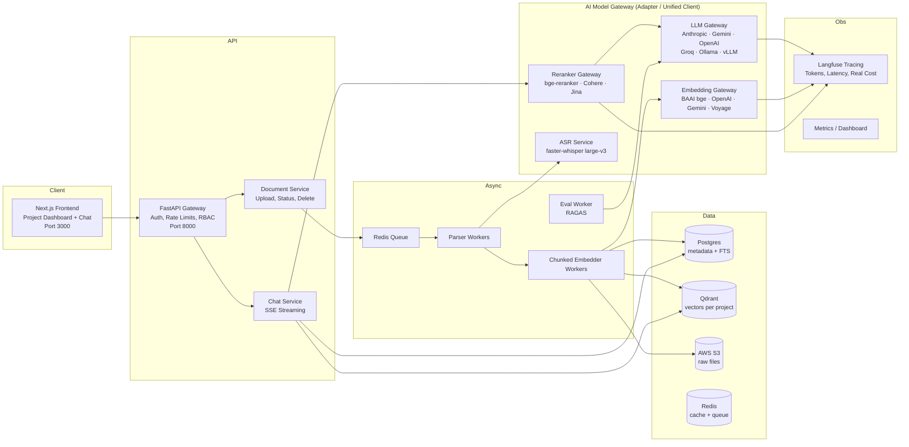

# Architecture — Enterprise Multi-Project Multimodal RAG Platform

**Product name:** SROT  
**Stack constraint (locked):** AWS S3 for all object storage (LocalStack emulator permitted for local dev). Pluggable, provider-agnostic AI model architecture configured entirely via environment variables (`.env`) — supports both enterprise cloud providers (Anthropic, Gemini, OpenAI, Groq, Mistral) and local inference (Ollama, vLLM, local embeddings/rerankers). Monorepo lifecycle orchestrated via root npm commands (`npm run setup`, `npm run dev`).

## 1. System Overview



## 2. Tech Stack

| Layer | Choice | License / Cost |
|---|---|---|
| Monorepo DX | Root `package.json` + `concurrently` (`npm run setup`, `npm run dev`) | MIT |
| Frontend | Next.js 15 (App Router) + TypeScript + Tailwind | MIT |
| Backend | FastAPI (async) + Pydantic v2 | MIT |
| Task queue | Celery + Redis | BSD / MIT |
| Relational DB | Postgres 16 + pg_trgm + FTS | PostgreSQL License |
| Vector DB | Qdrant (self-hosted) | Apache-2.0 |
| Object store | **AWS S3** (LocalStack emulator for local dev — same API, zero code changes) | AWS / Apache-2.0 |
| LLM + Judge Gateway | **Pluggable Multi-Provider Client** (Anthropic, Gemini, OpenAI, Groq, Ollama, vLLM) | Configured via `.env` |
| Embeddings | **bge-large-en-v1.5** (default local) or **OpenAI / Gemini / Voyage** | Configured via `.env` |
| Reranker | **bge-reranker-v2-m3** (default local) or **Cohere / Jina** | Configured via `.env` |
| ASR | **faster-whisper** (large-v3) + ffmpeg for audio extraction | MIT |
| PDF/DOCX parsing | `unstructured` (OSS mode) | Apache-2.0 |
| Tracing | Langfuse (self-hosted edition) | MIT |
| Evaluation | RAGAS + pytest (judge = configured LLM provider) | Apache-2.0 |
| Auth | JWT access (15 min) + rotating refresh (7 d), httpOnly cookies | — |

## 3. Repository Structure (Monorepo)

```
srot/
├── package.json                  # Root runner: npm run setup, npm run dev, npm run test
├── scripts/                      # setup.sh / setup.js (bootstraps env, docker, python, models)
├── apps/
│   ├── web/                      # Next.js frontend
│   │   ├── package.json
│   │   ├── app/(dashboard)/projects/[id]/...   # project pages
│   │   ├── components/chat|upload|viewer|confidence
│   │   └── lib/api-client.ts
│   └── api/                      # FastAPI backend
│       ├── requirements.txt / pyproject.toml
│       ├── main.py
│       ├── core/                 # config, security, deps, logging
│       │   ├── prompts/          # versioned prompt templates (v1, v2, ...)
│       │   └── models/           # provider adapters: llm, embedder, reranker, whisper
│       │       ├── base.py       # BaseLLMClient interface
│       │       ├── providers/    # anthropic.py, gemini.py, openai.py, groq.py, ollama.py, vllm.py
│       │       ├── embedder.py   # Embedding adapter
│       │       └── reranker.py   # Cross-encoder adapter
│       ├── modules/
│       │   ├── auth/             # router, service, repo, schemas
│       │   ├── projects/
│       │   ├── documents/        # upload, status, delete
│       │   ├── ingestion/        # parsers/, chunker.py, tasks.py
│       │   ├── retrieval/        # hybrid.py, rerank.py, query_rewrite.py
│       │   ├── chat/             # sessions, streaming, citations
│       │   ├── confidence/       # scoring
│       │   └── evaluation/       # ragas_runner, golden_sets
│       ├── alembic/              # migrations
│       └── tests/                # unit + integration (golden eval)
├── infra/
│   ├── docker-compose.yml        # pg, qdrant, redis, localstack(s3), langfuse,
│   │                             # embedder, reranker, whisper, worker(s), optional ollama
│   └── docker-compose.prod.yml   # real S3, GPU or cloud provider integration
├── docs/
│   ├── prd.md · architecture.md · security.md · schema.md
│   ├── api.md · checklist.md · rules.md
│   └── eval/                     # golden Q&A sets per project slug
└── Makefile                      # setup, up, models-pull, migrate, test, eval
```

## 4. Key Design Decisions

### 4.0 Unified Monorepo Execution & Setup
The project root exposes standard commands for developers:
- `npm run setup`: Runs the orchestration script `scripts/setup.sh` which:
  1. Verifies/creates `.env` from `.env.example`
  2. Installs Python dependencies in `apps/api` (creates virtualenv if not present)
  3. Installs Node.js dependencies in `apps/web` and root
  4. Starts all required background docker containers (`docker compose up -d postgres redis qdrant localstack langfuse embedder reranker whisper`)
  5. Waits for health readiness, runs Alembic DB migrations, and verifies required models
- `npm run dev`: Uses `concurrently` to run both `apps/api` (uvicorn backend on port 8000) and `apps/web` (Next.js frontend on port 3000) simultaneously with unified log streaming.

### 4.1 Project-scoped collections
One Qdrant collection per project (`proj_<project_id>`) for hard isolation, trivial deletion cascade, and per-project backup.

### 4.2 Content-addressed files
Files are hashed (SHA-256) before upload → dedupe per project, idempotent re-ingestion, safe retries. S3 key convention: `projects/{project_id}/docs/{sha256}/v{version}`.

### 4.3 Parent–child chunking
- Child chunk: 150–300 tokens, embedded + retrieved
- Parent chunk / section: up to 1500 tokens, fetched at answer time from Postgres
- Preserves context, improves citation precision

### 4.4 Hybrid retrieval with RRF
```
RRF_score(d) = Σ  1 / (k + rank_i(d)), k=60
```
BM25 (Postgres FTS over chunks) + dense ANN (Qdrant, vector embeddings) → RRF fuse top 40 → cross-encoder reranker → top 8 parents to LLM.

### 4.5 Citations are first-class
- Every inference call receives chunks **with stable IDs** (UUID)
- LLM must answer in structured JSON mode: `{ "answer_md": ..., "claims": [{ "text": ..., "citation_ids": [...] }] }`
- Server validates: every `citation_id` exists in the retrieved set; every claim has ≥1 citation. Invalid → one repair retry with a repair prompt; still invalid → verdict `unverified`, confidence capped at 0.49.

### 4.6 Insufficiency gate
If top reranker score < `RERANK_MIN_SCORE` (env-configurable):
- Return: "I don't have enough evidence in this project's documents to answer that."
- List the documents that were searched (from project metadata)
- Never invent, never omit, never silently degrade

### 4.7 Confidence scoring
Implemented in `modules/confidence/service.py` per PRD §8. Inputs: judge-LLM faithfulness call, normalized reranker score, claim coverage ratio, latency penalty. Stored on `assistant_turns` for audit + feedback. The judge uses the configured LLM provider with a deterministic, low-temperature prompt.

### 4.8 Secrets & config
Everything loaded from environment (`pydantic-settings`). Zero hardcoded keys, URLs, model names, or thresholds. Local `.env`, production via secrets manager.

### 4.9 Multi-Provider Model Strategy
The system uses a pluggable adapter pattern (`BaseLLMClient`, `BaseEmbedder`, `BaseReranker`).

```
                              ┌────────────────────────────────┐
                              │     BaseLLMClient (Unified)    │
                              └───────────────┬────────────────┘
                                              │
    ┌──────────────┬───────────────┬──────────┴───┬──────────────┬───────────────┐
    │              │               │              │              │               │
┌───▼────┐   ┌─────▼────┐   ┌──────▼─────┐  ┌─────▼────┐   ┌─────▼────┐   ┌──────▼─────┐
│ Ollama │   │   vLLM   │   │ Anthropic  │  │  Gemini  │   │  OpenAI  │   │    Groq    │
└────────┘   └──────────┘   └────────────┘  └──────────┘   └──────────┘   └────────────┘
```

#### Switching Providers via `.env`
Change providers seamlessly without altering code:

```bash
# Example 1: Local Ollama (Dev / Airgapped)
LLM_PROVIDER=ollama
LLM_BASE_URL=http://localhost:11434/v1
LLM_MODEL=llama3.1:8b-instruct-q4_K_M

# Example 2: Anthropic Claude (Production Reasoning)
LLM_PROVIDER=anthropic
LLM_MODEL=claude-3-5-sonnet-20241022
ANTHROPIC_API_KEY=sk-ant-...

# Example 3: Google Gemini (High Speed / Multimodal)
LLM_PROVIDER=gemini
LLM_MODEL=gemini-2.0-flash
GEMINI_API_KEY=AIzaSy...

# Example 4: Groq (Ultra-low latency Llama inference)
LLM_PROVIDER=groq
LLM_MODEL=llama-3.3-70b-versatile
GROQ_API_KEY=gsk_...

# Example 5: OpenAI
LLM_PROVIDER=openai
LLM_MODEL=gpt-4o-mini
OPENAI_API_KEY=sk-proj-...
```

### 4.10 Observability contract
Every request emits: `trace_id` end-to-end; Langfuse spans for retrieval, rerank, and llm_calls capturing provider, model name, prompt tokens, completion tokens, latency, and exact cost calculation (`cost_usd`).

## 5. Ingestion Pipeline (Detailed)

```
upload
  → store raw file (S3, key = projects/{pid}/docs/{sha256}/v{n})
  → create document row (status=queued)
  → route to parser by MIME:
      PDF/DOCX   → unstructured (OSS) → structured elements
      MD/TXT     → native readers → semantic sections
      XLSX/CSV   → row serialization ("col: value" per row, header context attached)
      MP3/MP4    → ffmpeg audio extract → faster-whisper large-v3 → segments {text, start, end}
  → chunker (heading-aware, parent–child, tables preserved)
  → metadata attach (project_id, doc_id, page OR ts_range OR row_range, chunk_idx, hash)
  → embed (configured embedder) + BM25 tokenization stored in Postgres FTS
  → upsert to Qdrant (dense per child) + Postgres (ftsv)
  → document status = indexed
```

Failures: retry with exponential backoff (3x), then `status=failed` with machine-readable error + human-readable reason surfaced in the frontend, with a Retry button that re-enqueues the job.

## 6. Chat Pipeline (Detailed, per request)

1. Query rewrite: if conversation history exists, configured LLM rewrites into a standalone query
2. Hybrid retrieval: BM25 top 40 + dense top 40 → RRF → top 40
3. Rerank (cross-encoder) → top 8 child chunks
4. Fetch parents → assemble context with citation IDs + source metadata
5. Prompt LLM with strict JSON schema + citation requirement
6. Validate citations server-side
7. Judge faithfulness (configured LLM provider, judge prompt) — surfaced in the stream as "verifying…" status
8. Compute confidence score
9. Stream answer + citations + confidence + verdict + token/cost metadata

## 7. Failure Modes & Behavior

| Failure | Behavior |
|---|---|
| Configured LLM unreachable / rate-limited | Explicit error card + retry button with retry-after header. Health page reflects provider status. |
| No chunks above threshold | Insufficiency message + searched-docs list |
| Embedding model not loaded / key invalid | Boot fails fast with clear error; ingestion queue pauses with alert |
| Ingestion parse crash | status=failed with reason; UI shows actionable Retry |
| Citation validation fails twice | Answer served flagged `unverified`, confidence capped at 0.49 |
| Qdrant down | Chat 503s with clear message; uploads still accepted (queued) |
| S3 unavailable | Uploads rejected with 503; indexed chat unaffected |

## 8. Deployment Targets

- **Dev:** `npm run setup` → `npm run dev` (starts web on :3000, api on :8000, and required docker containers).
- **Prod (Cloud LLM mode):** Docker/K8s cluster with api, workers, postgres, qdrant, redis, real AWS S3 bucket, Langfuse; LLM calls routed to Anthropic/Gemini/OpenAI/Groq via `.env` API keys.
- **Prod (Self-Hosted GPU mode):** GPU nodes running vLLM or Ollama for full air-gapped/zero-egress compliance; same backend code, zero diffs.
