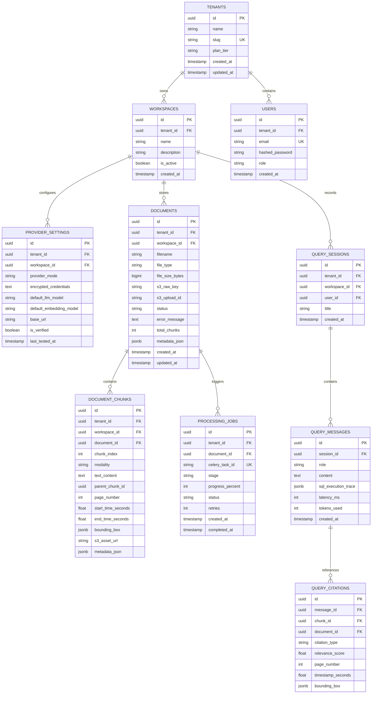

# Data Architecture & Schemas Specification

## Project: SROT (Advanced Multimodal Enterprise RAG)
**Document Version:** 1.1.0  
**Status:** Approved for Agile Execution  

---

## 1. Relational Database Schema (PostgreSQL 16)

Implemented via **SQLAlchemy 2.0 Async** and managed with **Alembic**. All multi-tenant tables enforce foreign keys and indexing on `tenant_id` and `workspace_id`.



### 1.1 Bounding Box Schema Specification (Item 3)
In `DOCUMENT_CHUNKS` and `QUERY_CITATIONS`, the `bounding_box` field is stored as JSONB with normalized coordinates ($0.0 \le \text{coord} \le 1.0$) relative to page width and height:
```json
{
  "ymin": 0.3215,
  "xmin": 0.1240,
  "ymax": 0.4480,
  "xmax": 0.8850,
  "page_width": 612.0,
  "page_height": 792.0
}
```

---

## 2. Qdrant Vector Collection Schema (v1.19.1)

### 2.1 Collection Definition: `srot_enterprise_rag`
```json
{
  "vectors": {
    "dense": {
      "size": 1536,
      "distance": "Cosine",
      "on_disk": true
    }
  },
  "sparse_vectors": {
    "sparse_bm25": {
      "index": {
        "on_disk": true
      }
    }
  },
  "hnsw_config": {
    "m": 16,
    "ef_construct": 100,
    "full_scan_threshold": 10000,
    "on_disk": true
  },
  "quantization_config": {
    "scalar": {
      "type": "int8",
      "quantile": 0.99,
      "always_ram": false
    }
  }
}
```

### 2.2 Point Payload Structure with Bounding Box
```json
{
  "id": "e4b2d312-3c22-48a1-b857-e17bc84d129a",
  "vector": {
    "dense": [0.0215, -0.0142, "...", 0.0874],
    "sparse_bm25": {
      "indices": [412, 1024, 8892],
      "values": [0.82, 0.45, 1.12]
    }
  },
  "payload": {
    "tenant_id": "tenant_enterprise_01",
    "workspace_id": "ws_legal_01",
    "document_id": "doc_contract_v2",
    "chunk_id": "chunk_0042",
    "parent_chunk_id": "chunk_parent_0012",
    "modality": "document",
    "content_preview": "9.2 Termination for IP Breach: Either party may terminate immediately...",
    "page_number": 14,
    "bounding_box": {
      "ymin": 0.3215, "xmin": 0.1240, "ymax": 0.4480, "xmax": 0.8850
    },
    "start_time_seconds": null,
    "end_time_seconds": null,
    "s3_asset_url": "s3://srot-media/tenant_01/ws_01/doc_contract_v2/pages/page_14.png",
    "created_at": 1727452800
  }
}
```

---

## 3. AWS S3 Storage Hierarchy

Object keys strictly segregate tenants and workspaces to ensure zero data cross-contamination:

```
s3://{SROT_BUCKET_NAME}/
└── {tenant_id}/
    └── {workspace_id}/
        └── {document_id}/
            ├── raw/
            │   └── master_contract.pdf
            ├── pages/
            │   ├── page_1.png
            │   └── page_14.png
            ├── keyframes/
            │   ├── frame_001.jpg
            │   └── frame_042.jpg
            ├── audio/
            │   └── audio_track.aac
            └── parquet/
                └── Q3_Expenses.parquet
```

---

## 4. Pydantic v2 Core Schemas

### 4.1 Onboarding & Sample Data Seeder (Item 7)
```python
from pydantic import BaseModel, Field, HttpUrl
from typing import Optional, Literal
from uuid import UUID

class ProviderConfigRequest(BaseModel):
    workspace_id: UUID
    provider_mode: Literal["cloud", "local", "hybrid"]
    api_key: Optional[str] = Field(None, description="Plaintext key sent over HTTPS; encrypted immediately with AES-256-GCM")
    base_url: Optional[str] = Field(None, description="Local Ollama/vLLM URL e.g. http://localhost:11434")
    default_llm_model: str = Field(..., example="gemini-2.0-flash")
    default_embedding_model: str = Field(..., example="text-embedding-3-large")

class ProviderHealthCheckResponse(BaseModel):
    healthy: bool
    provider_mode: str
    resolved_model: str
    latency_ms: float
    error_message: Optional[str] = None

class SeedSampleDataRequest(BaseModel):
    workspace_id: UUID

class SeedSampleDataResponse(BaseModel):
    queued_jobs: int
    document_ids: list[UUID]
    message: str
```

### 4.2 S3 Multipart Presigned Upload Flow (Item 2)
```python
class MultipartInitiateRequest(BaseModel):
    workspace_id: UUID
    filename: str
    file_type: str
    file_size_bytes: int
    chunk_size_bytes: int = 10 * 1024 * 1024  # 10 MB

class MultipartInitiateResponse(BaseModel):
    document_id: UUID
    upload_id: str
    s3_raw_key: str
    total_parts: int

class PresignPartsRequest(BaseModel):
    document_id: UUID
    upload_id: str
    part_numbers: list[int]

class PresignedPartItem(BaseModel):
    part_number: int
    presigned_url: str

class PresignPartsResponse(BaseModel):
    parts: list[PresignedPartItem]

class PartCompletedItem(BaseModel):
    part_number: int
    etag: str

class MultipartCompleteRequest(BaseModel):
    document_id: UUID
    upload_id: str
    parts: list[PartCompletedItem]
```

### 4.3 Server-Sent Events (SSE) Progress Schema (Item 6)
```python
class IngestionProgressEvent(BaseModel):
    document_id: UUID
    stage: Literal[
        "UPLOADED",
        "PARSING_LAYOUT",
        "EXTRACTING_BOUNDING_BOXES",
        "WHISPER_TRANSCRIBING",
        "SCENE_DETECTING",
        "CONVERTING_PARQUET",
        "CHUNKING",
        "QDRANT_INDEXING",
        "READY",
        "FAILED"
    ]
    percent: int = Field(..., ge=0, le=100)
    message: str
    timestamp: int
```

### 4.4 Analytical Query & Grounded Citations with Bounding Boxes
```python
class QueryRequest(BaseModel):
    workspace_id: UUID
    prompt: str = Field(..., min_length=2, max_length=2000)
    session_id: Optional[UUID] = None
    stream: bool = True

class BoundingBoxCoordinates(BaseModel):
    ymin: float
    xmin: float
    ymax: float
    xmax: float
    page_width: float
    page_height: float

class CitationItem(BaseModel):
    citation_id: str
    document_id: UUID
    document_name: str
    modality: Literal["document", "tabular", "video", "audio", "image"]
    page_number: Optional[int] = None
    bounding_box: Optional[BoundingBoxCoordinates] = None
    start_time_seconds: Optional[float] = None
    end_time_seconds: Optional[float] = None
    relevance_score: float
    snippet: str
    s3_asset_url: Optional[str] = None
```
